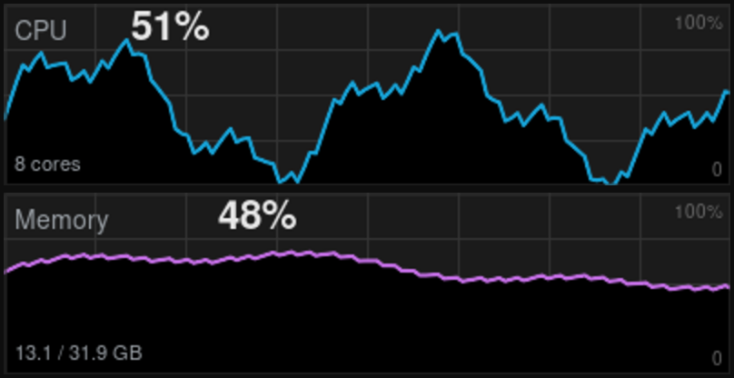

# ulanzi-system-monitor

An **Ulanzi Deck** plugin that shows live **CPU** and **memory** graphs in the
style of the **Windows 10 Task Manager**, tiled across a row of keys to form one
wide graph.



The D200H "information window" is a built-in Ulanzi Studio widget and is **not**
accessible to plugins, so the SDK only lets a plugin draw to the LCD **keys**.
This plugin turns a **block of keys** into one graph: it renders a
Task-Manager-style SVG across the block and crops it per key via the SVG
`viewBox`, so the line is continuous. Place the action on a row, a column, or a
**matrix (e.g. 3×3)** — keys sharing a metric join into one graph that grows
wider AND taller. Use one block for CPU and another for Memory to show both.

**Remote hosts (v1.3):** monitor other machines too. Run the tiny zero-dependency
[`sysmon-agent`](agent/) on any **Tailscale** host and add a **Host Switch** key —
pressing it cycles the monitored host and switches the data source for every graph
key on the deck. The key shows the host's alias and a Material Design icon you pick.

The plugin itself lives in
[`com.ulanzi.sysmonitor.ulanziPlugin/`](com.ulanzi.sysmonitor.ulanziPlugin/) —
see its [README](com.ulanzi.sysmonitor.ulanziPlugin/README.md) for usage and
settings. The host agent lives in [`agent/`](agent/README.md).

## Install (Windows)

Download the zip from [**Releases**](../../releases), fully quit Ulanzi Studio,
unzip `com.ulanzi.sysmonitor.ulanziPlugin\` into
`%APPDATA%\Ulanzi\UlanziDeck\Plugins\`, then restart Ulanzi Studio and drop the
**System Monitor** action across a row of keys.

## Build & test

```bash
./pack.sh                  # vendors `ws`, zips the plugin into dist/
node test/test-sysmon.mjs  # layout, SVG render + slicing, sampler (any OS)
```

Built with the [UlanziDeck Plugin SDK](https://github.com/UlanziTechnology/UlanziDeckPlugin-SDK). Apache-2.0.
